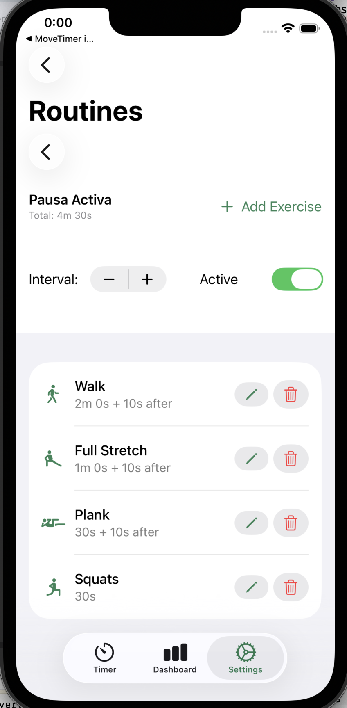
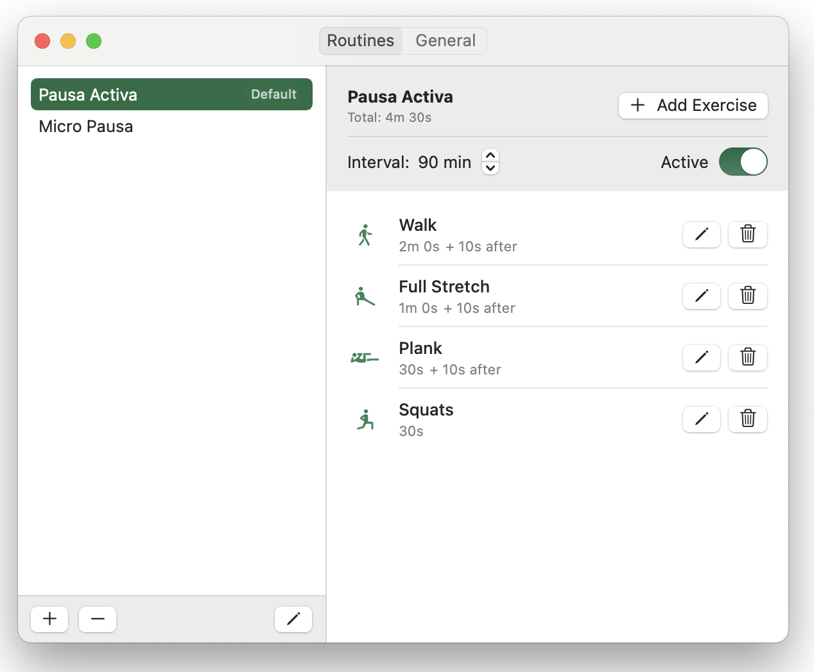

# Pulse

A macOS and iOS app that reminds you to take exercise breaks during work sessions. On macOS it lives in the menu bar; on iOS it works as a standalone app.

### iOS

  

### macOS

  

Pulse runs quietly in your menu bar, tracking your work intervals. When the timer is up, it guides you through a short exercise routine with voice instructions and a countdown timer.

## Features

- **Work interval timers** — Set how long you want to work before taking a break (default: 45 minutes). Multiple routines can run in parallel with independent intervals.
- **Exercise routines** — Create custom routines with exercises, sets, rest periods, and ordering.
- **Voice guidance** — Audio announcements and countdowns guide you through each exercise hands-free.
- **Auto-start exercises** — When a timer completes, exercises begin automatically after a short countdown. You can postpone if needed.
- **Smart screen detection** — Timers pause when your screen sleeps and resume when you're back, so they only count active time.
- **Restart timers** — Reset all counters to zero when you sit down, so break reminders start fresh from that moment.
- **Notifications** — System notifications with quick actions to start, snooze, or skip exercises.
- **Dashboard** — Daily and weekly stats, exercise history, and streak tracking.
- **HealthKit integration** — Optionally log completed exercises to Apple Health.

## Requirements

- macOS 14.0+ / iOS 17.0+
- Xcode 15+

## Building

Open `Pulse.xcodeproj` in Xcode and run. No external dependencies.

## License

MIT
